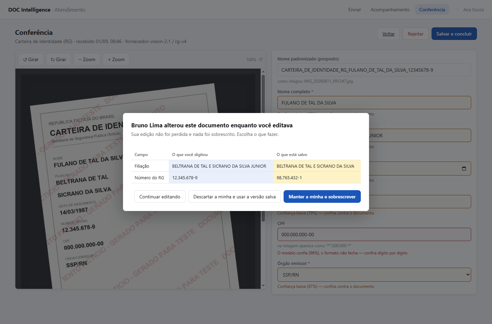

# DOC Intelligence — interface do atendimento

[](https://github.com/eng-leopoldocouto/DOC-Intelligence/actions/workflows/ci.yml)


**Trilha B (front-end)** · Questão prático-subjetiva LAMARCK · Leopoldo Couto

Serviço de inteligência documental para um escritório de advocacia. Documentos
chegam por WhatsApp, e-mail e balcão; um modelo multimodal classifica e extrai
campos; quando a máquina não tem confiança, uma pessoa confere.

Esta entrega é **a interface do atendimento e o contrato da API** — que ainda não
existe, é meu para definir, e é servido por mock.

---

## As duas telas que valem a leitura

**A conferência: o documento original ao lado dos campos extraídos.** A foto está
torta porque veio do celular do atendimento (fato b) — daí os controles de girar
e ampliar. Cada campo carrega a confiança do modelo, e o CPF traz o aviso do
**segundo portão**: o modelo declara 96% e o dígito verificador não fecha
([ADR-015](docs/adr/015-segundo-sinal-de-confianca.md)).


**O conflito entre dois conferentes.** Ana e Bruno abriram o mesmo documento; Bruno
salvou primeiro. A gravação da Ana **não é descartada nem sobrescrita** — o
diálogo nomeia quem alterou, mostra os campos divergentes lado a lado e devolve
a decisão para a pessoa ([ADR-009](docs/adr/009-concorrencia-na-fila.md), fato g).



Todos os dados das capturas são fictícios e gerados por script: nomes
inequivocamente falsos, CPF `000.000.000-00` (inválido pelo dígito verificador) e
marca d'água em cada documento.

---

## Para quem vai avaliar: cinco minutos

> O enunciado diz que o que se mede é *"o quanto conseguimos entender, lendo o
> que você entregou, como você pensa"*. Este bloco é o caminho mais curto para
> isso, e cada afirmação abaixo é **verificável por comando**, não por
> confiança.

### 1. Leia o que **não** foi feito — 2 min

**[`docs/spec/07-nao-feito.md`](docs/spec/07-nao-feito.md)**

O enunciado diz "queremos ler sobretudo o que você não fez". Está lá, com custo
estimado e **gatilho de retomada** para cada item — porque "não fiz" sem
estimativa é opinião.

### 2. Veja como os sete fatos do ambiente foram tratados — 2 min

**[`docs/spec/05-fatos-do-ambiente.md`](docs/spec/05-fatos-do-ambiente.md)**

Sete fatos, cada um com a consequência que enxerguei, a decisão tomada, onde ela
vive no código e o **risco residual**. Três foram resolvidos, quatro foram
tratados *e* deixaram risco registrado. Nenhum ficou sem resposta.

### 3. Confira que o texto corresponde ao código — 1 min

A entrega inteira se apoia na afirmação de que o front-end não conhece nenhum
tipo de documento. **Não acredite; rode:**

```bash
npm test                    # 95 testes, inclusive as guardas de arquitetura
git show spec-v1 --stat     # a spec, congelada ANTES do primeiro commit de código
npm run gen:api             # regenera os tipos do OpenAPI: o diff sai vazio
```

---

## Onde cada critério de pontuação foi respondido

| Peso | Critério | Onde ler |
|---|---|---|
| **30%** | Arquitetura e modularidade — *"o que acontece quando uma peça precisa ser trocada"* | [`04-arquitetura.md`](docs/spec/04-arquitetura.md): **seis costuras nomeadas**, cada uma com o custo real da troca. A resposta central: adicionar um tipo de documento novo custa **zero linhas de front-end** ([ADR-008](docs/adr/008-campos-dirigidos-por-schema.md)) |
| **20%** | Rastreabilidade das decisões | [`docs/adr/`](docs/adr/) — 15 decisões, cada uma com as alternativas descartadas **pelo motivo real** e uma seção *"como saberemos que erramos"*. Decisão sem critério de refutação é preferência pessoal com aparência de engenharia |
| **20%** | Uso de IA como ferramenta de engenharia | [`docs/ia/`](docs/ia/) — prompts íntegros, registro de verificação, transcrição completa da sessão e das **quatro auditorias**, e o parágrafo sobre [onde o agente errou](docs/ia/onde-o-agente-errou.md). Além do `CLAUDE.md` e do subagente auditor, um **hook que bloqueia a escrita** que quebraria as regras 2 e 3 — a regra deixa de depender de boa vontade ([`docs/ia/README.md`](docs/ia/README.md)) |
| **15%** | Especificação e método | [`docs/spec/`](docs/spec/) congelada na tag `spec-v1`, 28 minutos antes do primeiro arquivo em `src/`. As **onze divergências** posteriores estão em [`08-divergencias.md`](docs/spec/08-divergencias.md), duas delas fechadas nesta rodada. O contrato é exercitável sem a interface: [`exemplos.http`](docs/spec/exemplos.http) |
| **15%** | Atenção e proatividade | [`05-fatos-do-ambiente.md`](docs/spec/05-fatos-do-ambiente.md) e as **seis premissas** que assumi no lugar das dúvidas que não houve tempo de enviar ([`00-visao-e-escopo.md`](docs/spec/00-visao-e-escopo.md)) |

---

## O que roda

Fatia vertical implementada:

```
envio em lote → acompanhamento → fila de conferência → correção de campo → gravação
```

| # | Comportamento do produto | Estado |
|---|---|---|
| 1 | Receber documento (imagem ou PDF) | **implementado** |
| 2 | Descobrir o tipo, extrair campos, propor nome | **implementado** (extração é do mock) |
| 3 | Consultar resultado e listar processados | **parcial** — consulta e listagem por estado sim; busca por termo não está no contrato |
| 4 | Portão de confiança e conferência humana | **implementado** |
| 5 | Ser consumido por sistemas internos | **contrato definido e servido** |

---

## Como subir

```bash
npm install
cp .env.example .env
npm run dev
```

Abre em <http://localhost:5173> com o mock ligado e a base semeada com dez
documentos — seis aguardando conferência, um `FALHOU` e um `EXPIRADO`, para que
os dois modos de falha do fato (a) apareçam sem depender de sorte.

| Comando | O que faz |
|---|---|
| `npm test` | 95 testes, incluindo as guardas de arquitetura |
| `npm run typecheck` | TypeScript estrito |
| `npm run lint` | oxlint, zero avisos ([D-08](docs/spec/08-divergencias.md), fechada) |
| `npm run build` | Build de produção |
| `npm run mock` | Serve o contrato em `http://localhost:8787/api/v1` |
| `npm run gen:api` | Regenera os tipos a partir de `docs/spec/openapi.yaml` |
| `npm run fixtures` | Regera os documentos fictícios (Python + Pillow) |

O contrato pode ser exercitado **sem abrir a interface** —
[`docs/spec/exemplos.http`](docs/spec/exemplos.http) traz nove requisições
prontas, cada uma dizendo qual fato do ambiente ela demonstra, incluindo o
envio duplicado e o `PATCH` com `If-Match` velho que produz o 409:

```bash
npm run mock
curl -s http://localhost:8787/api/v1/tipos-documento
```

---

## Roteiro de demonstração — cada passo prova um fato do ambiente

Os documentos estão em `fixtures/documentos-ficticios/`. Nenhum dado real de
pessoa: todos gerados por script, com marca d'água, CPF `000.000.000-00`
(inválido pelo dígito verificador).

| # | O que fazer | O que observar | Fato |
|---|---|---|---|
| 1 | Arraste os **seis** arquivos de uma vez | Cinco sobem; `copia de WhatsApp Image…` é barrada **antes de qualquer requisição** — o hash é calculado no cliente | (c), (a) |
| 2 | **Reenvie os mesmos arquivos** | Agora quem barra é o servidor: *"já enviado em…"*, sem disparar processamento novo. São as duas camadas de deduplicação | (c) |
| 3 | Vá ao Acompanhamento | Latência sorteada de 5 a 40 s, ~8% falham. **Tempo decorrido, nunca barra de progresso** — não sabemos a porcentagem e não vamos inventá-la | (a) |
| 4 | Clique em **Reprocessar** num que falhou | Exige confirmação **que informa o custo**. Nada reprocessa sozinho | (a) |
| 5 | Abra a Conferência | O primeiro da fila é uma foto **torta** — gire e amplie. Os campos vêm do schema da API, cada um com sua confiança individual | (b), (f) |
| 6 | Note o CPF na lista × na conferência | Mascarado na listagem (onde é contexto), inteiro na conferência (onde é o trabalho) | (d) |
| 7 | **Abra o mesmo documento em duas abas.** Salve na primeira; tente salvar na segunda | O diálogo **nomeia quem alterou**, mostra os campos divergentes lado a lado, e não descarta nem sobrescreve nada | (g) |

O passo 7 é o mais importante da entrega. Sem ele, a correção de uma pessoa
desaparece em silêncio e o dado errado segue para a planilha e para o processo.

---

## Como o repositório está organizado

```
docs/spec/       a especificação, escrita ANTES do código      ← tag spec-v1
docs/adr/        15 decisões, com as alternativas descartadas
docs/plano/      o plano de implementação em 16 tarefas
docs/ia/         prompts, verificações, tempo real, transcrição da sessão
docs/enunciado.md
fixtures/        documentos fictícios e como regerá-los
src/             a fatia vertical
tests/           95 testes, incluindo guardas de arquitetura
.claude/agents/  o subagente auditor, autorado para esta prova
.claude/hooks/   o hook que BLOQUEIA a escrita que quebraria as regras 2 e 3
.github/         a CI que faz as guardas falharem o build de verdade
```

```
src/
  app/        composição: router, providers
  pages/      telas de rota
  features/   upload · processing · review
  entities/   domínio puro — sem React, sem fetch, sem window
  shared/
    api/      ÚNICA costura de rede + tipos gerados do OpenAPI
    lib/      hash, imagem/EXIF, máscara, formatação
    ui/       estilos
  mocks/      handlers MSW — navegador, testes e HTTP, um só conjunto
```

Regra de dependência `app → pages → features → entities → shared`,
**verificada por teste** em [`tests/arquitetura/`](tests/arquitetura/fronteiras.test.ts).

---

## O que escolhi testar, e por quê

São 95 testes, e o critério para escrevê-los não foi cobertura: foi **o que
quebraria em silêncio**. Um botão que some é descoberto em cinco minutos de uso;
uma correção de campo sobrescrita por outra pessoa não é descoberta nunca — vira
dado errado numa planilha e reaparece semanas depois dentro de um processo. Por
isso o teste mais importante da entrega verifica quatro coisas ao mesmo tempo no
conflito de gravação: que o sistema avisa, que **nomeia quem** alterou, que não
descarta a edição de quem chegou depois e que não sobrescreve a de quem chegou
antes. Pela mesma lógica testei o que **não deve acontecer**: que a duplicata não
gere um segundo documento, e que rejeitar não dispare reprocessamento — este
último contando as chamadas que *não* foram feitas, porque efeito colateral
ausente não se prova de outro jeito. Um teste renderiza um tipo de documento que
o front-end nunca viu, e é ele que sustenta a promessa central da arquitetura: se
falhar, a especificação inteira é conversa fiada. E cinco testes de arquitetura
verificam por máquina as regras que, escritas apenas no `CLAUDE.md`, seriam
sugestões. Deixei de fora deliberadamente aparência e decodificação de imagem com
EXIF: em jsdom eles passariam sem provar nada, e teste que passa sem provar nada
é pior que teste ausente, porque dá falsa segurança.

---

## Sobre o uso de IA — item II.4

Trabalhei com **Claude Opus 5** em sessão interativa. O registro completo está em
[`docs/ia/`](docs/ia/):

| Arquivo | O que é |
|---|---|
| [`prompts/`](docs/ia/prompts/) | Os 12 prompts, íntegros e em ordem. **Erros de digitação preservados** — o enunciado pede "como foram escritos" |
| [`registro-de-verificacao.md`](docs/ia/registro-de-verificacao.md) | Sete entradas: o que o agente produziu, o que conferi, onde errou, o que fiz |
| [`onde-o-agente-errou.md`](docs/ia/onde-o-agente-errou.md) | O parágrafo em primeira pessoa exigido pelo enunciado |
| [`registro-de-tempo.md`](docs/ia/registro-de-tempo.md) | Relógio real por fase, **com três correções registradas em vez de apagadas** |
| [`transcricao/`](docs/ia/transcricao/) | A sessão inteira **e as quatro rodadas de auditoria**, com os comandos que o auditor rodou na íntegra. Geradas por script, não editadas à mão |

**A fronteira do que é meu:** o `CLAUDE.md` e o subagente auditor foram autorados
para esta prova. Os plugins Superpowers e ECC já estavam instalados no ambiente e
são ferramenta, como o editor — a distinção está declarada em
[`docs/ia/README.md`](docs/ia/README.md), porque reivindicar plugin de terceiro
como trabalho próprio seria desonesto.

### O ciclo que mais rendeu

Ao final, pus um **subagente auditor** para conferir a entrega contra o enunciado,
em contexto frio, com uma instrução no centro: *não acreditar na narrativa do
repositório sobre si mesmo*. Rodei **quatro vezes**.

Cada rodada encontrou o que a correção anterior tinha introduzido. Na terceira, o
auditor nomeou o padrão: **o defeito não está no item apontado — está no vizinho
aritmético dele, ou no outro documento que o cita.** A quarta rodou depois de uma
auditoria externa ao repositório, cujo prompt está íntegro em
[`prompts/0014`](docs/ia/prompts/0014-2026-09-01-auditoria-externa-defeitos.md).

As **transcrições das quatro rodadas** estão em
[`docs/ia/transcricao/auditorias/`](docs/ia/transcricao/auditorias/), com os 110
comandos que o auditor rodou **na íntegra** — é neles que se vê a verificação
acontecendo, e não apenas a conclusão dela. A história em prosa está em
[`V-007` e `V-008`](docs/ia/registro-de-verificacao.md), e a conclusão é a única
coisa desta entrega que eu levaria para qualquer projeto:

> O autor não consegue auditar o próprio texto contra o próprio código, porque lê
> o texto e lembra da intenção em vez de ver o que ficou. O valor do subagente não
> foi capacidade técnica — foi **não ter memória do que eu quis dizer**.

---

## Limitações conhecidas

Declaradas aqui porque escondê-las seria o oposto do que os documentos deste
repositório afirmam praticar.

- **O estado do mock vive em memória.** Recarregar zera o que você enviou e
  restaura os dez documentos semeados. Ele é um dublê, não um banco.
- **Sem autenticação.** A identidade vem do host interno por cabeçalho
  ([ADR-011](docs/adr/011-identidade-delegada-ao-host.md)). Apague
  `VITE_USUARIO_ID` do `.env` para ver a degradação anônima funcionando.
- **Sem busca por termo.** O contrato tem `GET /documentos` com **filtro por
  estado, limite e cursor** — é isso que o mock serve e é o que a fila usa.
  **Busca por termo não foi especificada** e não existe tela
  ([`07-nao-feito.md`](docs/spec/07-nao-feito.md), [D-10](docs/spec/08-divergencias.md)).
- **A fila pagina por cursor, mas não é virtualizada** — a spec prometia as duas
  coisas ([D-06](docs/spec/08-divergencias.md)).
- **Sem bloqueio por inatividade** na conferência ([D-07](docs/spec/08-divergencias.md)).
- **HEIC do iPhone é recusado**, com instrução de como contornar. Risco conhecido
  e não resolvido.
- **A conferência é uma tela de computador, por decisão.** Envio e acompanhamento
  funcionam a 360 px; a conferência avisa, abaixo de 760 px, que ali se confere
  pior ([ADR-014](docs/adr/014-enviar-e-movel-conferir-e-desktop.md)). A
  responsividade foi verificada redimensionando o navegador, **não em aparelho
  real** — o zoom do iOS ao focar campo com fonte de 14 px é defeito conhecido e
  não tratado.
- **O segundo portão marca o campo, e não muda o estado do documento.** Um
  documento já `PRONTO` com CPF inválido continua `PRONTO`; mover estado é do
  servidor ([ADR-015](docs/adr/015-segundo-sinal-de-confianca.md),
  [`07-nao-feito.md`](docs/spec/07-nao-feito.md)).
- **A pressão da fila conta o que foi carregado**, não o total: com paginação por
  cursor a interface escreve "50+", e não "50". E os dois limites que acendem o
  destaque estão no código do cliente, quando deveriam vir do contrato.

---

## Carta de fechamento

[`docs/carta-de-fechamento.pdf`](docs/carta-de-fechamento.pdf) — duas páginas,
respondendo às quatro perguntas do enunciado.
